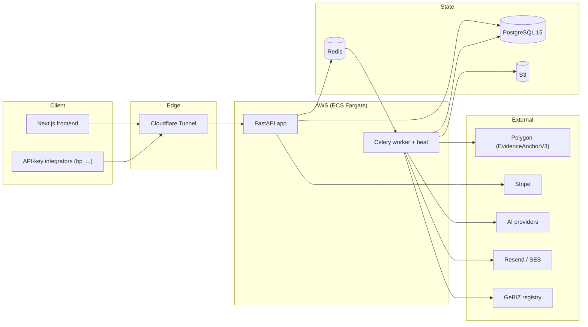
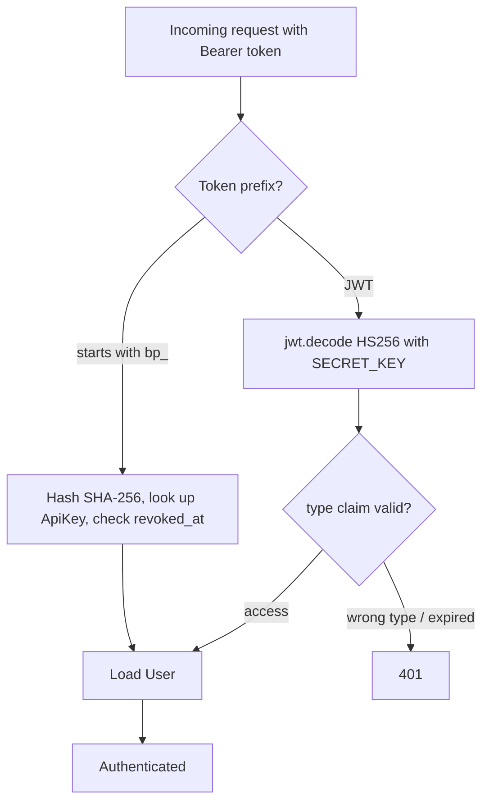
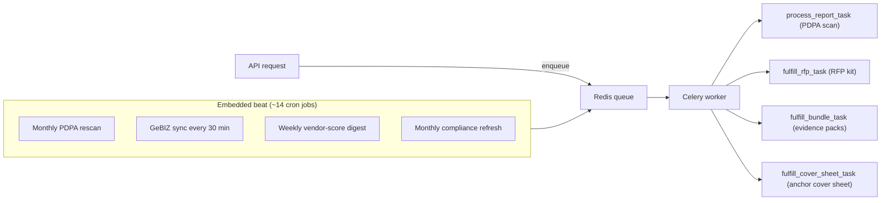
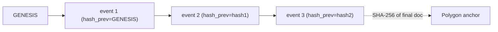
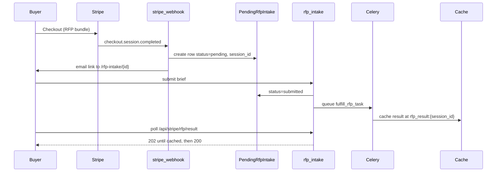

# Architecture

Booppa's backend is a modular monolith: one FastAPI process for the synchronous request path, one Celery worker process for slow and expensive work, sharing a single PostgreSQL database and a single Redis instance. This document explains how the pieces fit and, more importantly, why they are arranged this way.

## Contents

- [System context](#system-context)
- [Why a monolith](#why-a-monolith)
- [The API layer](#the-api-layer)
- [The model layer](#the-model-layer-versioned-not-domain-split)
- [Authentication flow](#authentication-flow)
- [Background work](#background-work)
- [Tamper evidence](#tamper-evidence)
- [Stripe purchase to fulfillment](#stripe-purchase-to-fulfillment)
- [External services](#external-services)
- [Data and connection model](#data-and-connection-model)

## System context



## Why a monolith

The domain is broad (PDPA, CSP/AML, procurement, billing, blockchain) but the team is small and the transactions are tightly coupled: a single purchase can touch billing, RFP intake, PDF generation, blockchain anchoring, and the audit log. Splitting these into services would trade a few clear in-process function calls for a distributed transaction problem with no operational payoff at this scale. The seams are drawn *inside* the process instead: `api/`, `services/`, `workers/`, `orchestrator/`, `billing/`, `core/`. If a domain ever needs its own deploy cadence, the service module is the natural extraction point. See [ADR-0005](ADR.md#adr-0005-modular-monolith-over-microservices).

## The API layer

57 routers under `app/api/` are assembled into one composite `api_router` in `app/api/__init__.py`. `app/main.py` mounts that composite router at **both** prefixes:

```python
app.include_router(api_router, prefix="/api/v1")
app.include_router(api_router, prefix="/api")   # deliberate compatibility alias
```

Any new endpoint therefore lands at both `/api/v1/...` and `/api/...` automatically; feature modules must not call `include_router` again. The unversioned `/api` surface exists because the Next.js frontend's live polling contracts depend on it (Stripe checkout verification, RFP result polling, RFP intake submit). It is documented as an alias, not an accident. The one caveat: slowapi keys its rate-limit buckets by path, so `/api/x` and `/api/v1/x` count separately. That is a known trade-off, recorded in [TRADEOFFS.md](TRADEOFFS.md).

## The model layer (versioned, not domain-split)

`app/core/models.py` defines the core tables (`User`, `Report`, `Subscription`, and the `AuditChainEvent` chain) and imports `models_v6.py` through `models_v13.py` plus `models_enterprise.py`, `models_csp.py`, `models_gebiz.py`, and others at its tail. That single import makes Alembic's metadata see all 105 tables from one place.

The convention is unusual and worth naming: tables are grouped by the *product rollout* that introduced them, not by domain.

- `models_v6` - vendor verification artifacts
- `models_v8` - PDPA dimension history, score snapshots
- `models_v10` - marketplace, funnel events, achievements, certificate logs
- `models_v11` - compliance locker
- `models_v12` - API keys, `PendingRfpIntake`
- `models_enterprise` - orgs, webhooks, SSO
- `models_csp` - the CSP/AML tables (clients, beneficial owners, CDD/EDD, risk, STR, training)

This keeps each rollout's migration self-contained and reviewable, at the cost of some cross-module navigation. `User.parent_user_id` is a nullable self-FK that carries multi-subsidiary tenancy, so queries that care about org boundaries must not filter on `user_id` alone.

## Authentication flow



Tokens are type-discriminated (`access`, `refresh`, `admin`, `password_reset`), so a refresh or reset token cannot be presented where an access token is expected. Full detail in [SECURITY.md](SECURITY.md).

## Background work

Celery runs on Redis, which serves as both broker and result backend. Beat is embedded in the worker via `-B`, so the worker container is the only place schedules fire (no separate beat process to operate). Two queues:

- `reports` - blocking, resource-heavy work: PDF generation, blockchain anchoring, S3 uploads.
- `default` - lighter async side effects.



## Tamper evidence

Two independent layers, on purpose. Either one alone has a gap; together they close it.

**Layer 1: on-chain anchoring.** A finished document is hashed with SHA-256. `BlockchainService` calls `anchorHash(bytes32 fileHash, string metadata)` on the `EvidenceAnchorV3` contract on Polygon. The contract stores `block.timestamp` per hash and rejects a hash that is already anchored, so anchoring is naturally idempotent. Anyone can later check the hash on a block explorer, without trusting Booppa.

**Layer 2: off-chain hash chain.** `append_audit_event` (in `app/services/audit_chain.py`) writes an `AuditChainEvent` per action on a report. Each event stores `hash_prev` (the previous event's hash, or the literal `"GENESIS"` for the first) and its own `hash`. Rewriting one event silently would break every subsequent link.



Why both: the chain proves *sequence integrity* cheaply for every event, but lives in the same database an attacker with write access could tamper with. The on-chain anchor proves *existence at a point in time* independently of the database, but paying gas per event would be prohibitive. Anchoring the final artifact while hash-chaining every event is the cost/assurance balance. See [ADR-0002](ADR.md#adr-0002-two-layer-tamper-evidence).

## Stripe purchase to fulfillment

Most products fulfill at webhook time. Bundles with an RFP component (`rfp_complete`, `rfp_express`, `rfp_accelerator`, `enterprise_bid_kit`, `compliance_evidence_pack`) cannot, because the buyer has to supply a brief first. They defer:



The verification endpoint `GET /api/stripe/checkout/verify` resolves `pending_rfp_intake_id`, `brief_satisfied`, and `requires_brief`, and does its `PendingRfpIntake` lookup **session-scoped first** (`session_id == this session`) before falling back to the latest pending row for the user. Loosening that to "latest regardless of status" is a known regression trap: an older `submitted` row from a prior cycle wins the `created_at desc` race and falsely reports `brief_satisfied=True`, leaving the result page stuck on "Generating..." forever. The response carries `Cache-Control: no-store` because the state flips as the webhook fires.

## External services

Concentrated in `app/services/` so integrations are swappable and testable:

- `pdf_service.py` - PDPA reports and notarization PDFs (ReportLab; shared `_section_header`, `_kv_table`, `_xml_escape` helpers).
- `cover_sheet_generator.py` - the Compliance Evidence Pack cover sheet, schema-versioned via `COVER_SHEET_SCHEMA_VERSION` so customers on an older layout get a free regenerate.
- `email_service.py` - Resend preferred, AWS SES fallback. `send_html_email` returns `False` on rejection and does not raise, so callers that care about delivery must check the return.
- `BlockchainService` - Polygon anchoring, idempotent on `report_id`.
- `S3Service` - uploads and presigned URLs (7-day expiry, re-presigned on each status fetch).
- `AIService` / `BooppaAIService` - multi-provider (Anthropic, DeepSeek, OpenAI, Ollama) routed by config; compliance narratives go through `BooppaAIService`.

## Data and connection model

The database engine is the **synchronous** SQLAlchemy 2.0 engine over psycopg2, with a tuned pool (`pool_size`, `max_overflow`, `pool_pre_ping`, `pool_recycle`). Request handlers use synchronous `Session` objects yielded by the `get_db` dependency. This means each in-flight request holds a pooled connection for its duration, so concurrency is bounded by pool size times process count, and slow work is deliberately pushed to Celery rather than awaited in-request. The reasoning, and the honest downside, is in [ADR-0004](ADR.md#adr-0004-synchronous-sqlalchemy) and [TRADEOFFS.md](TRADEOFFS.md).
