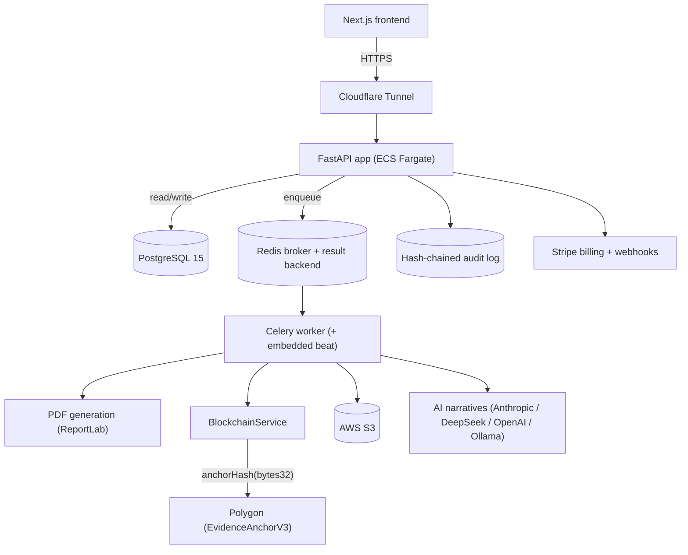

# Booppa Backend

Compliance evidence platform for Singapore corporate-service providers and enterprise procurement teams. Booppa turns regulatory obligations (PDPA data protection, ACRA/CSP anti-money-laundering duties, and RFP/tender compliance) into signed, timestamped, tamper-evident evidence that an auditor or a buyer can verify independently.

This repository is the API backend: a FastAPI service with 57 routers, roughly 75 service modules, 105 database tables, and a Celery worker fleet, anchoring evidence hashes to the Polygon blockchain and generating auditor-ready PDF reports.

> Status: production system operated by Booppa Smart Care LLC (Singapore). Blockchain anchoring runs on Polygon Amoy testnet by default, with a guarded mainnet path (see [Trade-offs](TRADEOFFS.md)).

---

## Table of contents

- [The business problem](#the-business-problem)
- [Why this project exists](#why-this-project-exists)
- [What it does](#what-it-does)
- [Architecture overview](#architecture-overview)
- [Technology stack](#technology-stack)
- [Authentication and authorization](#authentication-and-authorization)
- [Security](#security)
- [Scalability](#scalability)
- [Deployment](#deployment)
- [API examples](#api-examples)
- [Local development](#local-development)
- [Further reading](#further-reading)

---

## The business problem

Singapore regulates three things that small and mid-sized firms consistently struggle to prove:

1. **PDPA data protection.** Under the Personal Data Protection Act, organisations must show they handle personal data responsibly. Most SMEs have no evidence trail when a customer, a regulator, or an enterprise buyer asks.
2. **CSP anti-money-laundering duties.** Corporate service providers (company incorporation, nominee directors, registered-office services) carry ACRA-supervised AML obligations: customer due diligence, risk classification, enhanced due diligence, suspicious-transaction reporting. The paperwork is real, recurring, and easy to get wrong.
3. **Procurement and RFP compliance.** Winning government (GeBIZ) and enterprise tenders means answering long compliance questionnaires and attaching evidence. Vendors redo this from scratch for every bid.

The common thread: compliance is not just *doing* the work, it is *proving* you did it, in a form a third party will trust after the fact.

## Why this project exists

A PDF that says "we are compliant" is worth nothing if the vendor could have edited it yesterday. Booppa's answer is to make each piece of evidence independently verifiable and tamper-evident:

- Every generated report is hashed with SHA-256.
- The hash is anchored on a public blockchain, so the document's existence at a point in time can be checked by anyone, without trusting Booppa.
- A separate application-level audit log hash-chains each event per report, so the sequence of actions on a document cannot be silently rewritten in the database either.

Two independent tamper-evidence layers (on-chain proof of existence, plus an off-chain hash chain) is the core engineering idea of the platform. See [ADR-0002](ADR.md#adr-0002-two-layer-tamper-evidence).

## What it does

- **PDPA scanning and scoring.** Runs a scan against a company's public data-handling surface, scores it across dimensions, tracks the score over time, and generates a PDPA report.
- **CSP compliance pack.** Manages the full AML lifecycle for corporate-service providers: clients, beneficial owners, CDD/EDD records, risk assessments and classification audits, STR reports, staff training, compliance calendar, and programme attestations, with sensitive PII encrypted at the application layer.
- **RFP and tender kits.** Generates compliance answer kits for procurement, including a deferred-intake flow so buyers supply their brief after purchase (see [ARCHITECTURE.md](ARCHITECTURE.md#stripe-purchase-to-fulfillment)).
- **GeBIZ tender intelligence.** Syncs Singapore government tenders every 30 minutes and pushes relevant ones to buyers.
- **Evidence packs and cover sheets.** Bundles the above into signed, schema-versioned deliverables with a blockchain-anchored compliance cover sheet.
- **Verification.** A public verify surface lets a recipient confirm a document's hash against the on-chain record.

## Architecture overview



The service is a modular monolith. One deployable FastAPI process serves the API; a Celery worker process handles everything slow or expensive (PDF rendering, blockchain anchoring, S3 uploads, scheduled jobs). Both share one PostgreSQL database and one Redis instance. The full narrative, including request flows and the model layout, is in [ARCHITECTURE.md](ARCHITECTURE.md).

## Technology stack

| Layer | Choice | Notes |
|-------|--------|-------|
| API framework | FastAPI 0.104 | 57 routers assembled into one composite router |
| Language | Python 3.11 | |
| Database | PostgreSQL 15 via SQLAlchemy 2.0 (synchronous engine, psycopg2) | 105 tables, versioned model modules |
| Migrations | Alembic | run on container boot by `entrypoint.sh` |
| Background jobs | Celery on Redis | Redis is both broker and result backend; beat embedded in the worker |
| Blockchain | web3.py against Polygon; `EvidenceAnchorV3` Solidity contract | Hardhat project under `hardhat/` |
| Auth | bcrypt (passlib) + HS256 JWT (python-jose) + `bp_` API keys | type-discriminated tokens |
| PII encryption | Fernet (AES-128-CBC + HMAC-SHA256), key from AWS Secrets Manager | SQLAlchemy `TypeDecorator` |
| Payments | Stripe Checkout + webhooks | scan-credit metering |
| SSO | SAML 2.0 (pysaml2) | enterprise tenants |
| PDF | ReportLab | shared layout helpers |
| Rate limiting | slowapi | 200/minute default |
| Observability | OpenTelemetry + Prometheus | |
| Deployment | Docker, ECS Fargate, Cloudflare Tunnel, Terraform; Mangum for Lambda compatibility | |

A note on honesty: `asyncpg` is present in requirements, but the live database engine is the **synchronous** SQLAlchemy engine (`create_engine` + psycopg2), and route handlers use synchronous `Session` objects. The system scales by process and worker concurrency, not by async database I/O. That trade-off is documented in [TRADEOFFS.md](TRADEOFFS.md).

## Authentication and authorization

`app/core/auth.py` issues HS256 JWTs signed with a single `SECRET_KEY`, discriminated by a `type` claim so a token minted for one purpose cannot be replayed for another:

- `access` (24h), `refresh` (30d), `admin` (12h), `password_reset` (30min).

Two credential paths reach the same `get_current_user` dependency (`app/core/db.py`):

- **JWT bearer** for interactive users.
- **API keys** prefixed `bp_`, stored only as SHA-256 hashes, checked for revocation, with `last_used_at` tracking.

Multi-subsidiary tenancy is modelled with a nullable self-referential `User.parent_user_id`, so a parent org and its subsidiaries share a tenancy boundary. See [SECURITY.md](SECURITY.md).

## Security

- Application-level encryption for sensitive PII (NRIC, passport, nominator IDs) via Fernet, with the key held in AWS Secrets Manager, never in env vars or code. Disk-level encryption alone is treated as insufficient under PDPA for a compliance platform.
- Two-layer tamper evidence: on-chain SHA-256 anchoring plus an off-chain hash-chained audit log.
- Passwords bcrypt-hashed; API keys stored hashed; startup refuses to boot in production with a default `SECRET_KEY`.
- A mainnet safety guard warns loudly if mainnet anchoring is enabled without a real contract address or signing key, preventing a burn to the null address.
- Rate limiting via slowapi; CORS origins are explicit (default `http://localhost:3000`), not a wildcard.

Known trade-offs and residual risks (HS256 single-secret vs asymmetric JWT, the dual `/api` mount and its rate-limit implication, testnet finality) are documented honestly in [SECURITY.md](SECURITY.md) and [TRADEOFFS.md](TRADEOFFS.md) rather than hidden.

## Scalability

- **Stateless API.** The FastAPI process holds no session state, so it scales horizontally behind the load balancer.
- **Work offloaded to Celery.** Anything slow (PDF rendering, gas-bearing blockchain writes, S3 uploads) runs in the worker on two queues: `reports` for blocking work, `default` for async side effects.
- **Anchoring is idempotent on `report_id`**, and the contract itself rejects re-anchoring a hash, so retries are safe.
- **Connection pooling** is tuned (`DB_POOL_SIZE`, `max_overflow`, `pool_pre_ping`, `pool_recycle`) because the synchronous engine ties a connection per in-flight request.

## Deployment

Containers run on AWS ECS Fargate behind a Cloudflare Tunnel. `entrypoint.sh` runs `alembic upgrade head` before uvicorn boots. Task definitions live in the `task-def-*.json` files; infrastructure is in `infra/terraform`. Full steps are in [DEPLOYMENT.md](DEPLOYMENT.md) and [DEPLOY_AWS.md](DEPLOY_AWS.md).

## API examples

Every endpoint is served at both `/api/v1/...` and `/api/...` (the unversioned mount is a deliberate compatibility alias for the frontend's polling contracts).

Health:

```bash
curl https://api.booppa.io/health
# {"status":"healthy","version":"10.0.0","service":"booppa-api"}
```

Authenticate:

```bash
curl -X POST https://api.booppa.io/api/v1/auth/token \
  -d "username=user@example.com&password=..." \
  -H "Content-Type: application/x-www-form-urlencoded"
```

Poll a post-checkout RFP result (returns 202 until the worker has cached the kit, then 200):

```bash
curl "https://api.booppa.io/api/stripe/rfp/result?session_id=cs_test_..."
```

See [API_REFERENCE.md](API_REFERENCE.md) for the full surface.

## Local development

Without Docker:

```bash
cp .env.example .env          # fill in credentials
alembic upgrade head          # required before first boot
uvicorn app.main:app --reload --port 8000
```

With Docker Compose:

```bash
docker compose up -d postgres redis
docker compose up app worker
```

Tests:

```bash
pytest -v
```

Stripe-dependent tests auto-skip unless `STRIPE_SECRET_KEY` starts with `sk_test_`. See [TESTING.md](TESTING.md).

## Further reading

- [ARCHITECTURE.md](ARCHITECTURE.md) - system design, request flows, model layout, background jobs.
- [SECURITY.md](SECURITY.md) - auth, encryption, tamper evidence, threat model, residual risks.
- [ADR.md](ADR.md) - the decisions and why (blockchain, hash chain, Celery, sync SQLAlchemy, monolith).
- [TRADEOFFS.md](TRADEOFFS.md) - the honest engineering compromises.
- [LESSONS.md](LESSONS.md) - what building this taught.
- [ROADMAP.md](ROADMAP.md) - what comes next.
