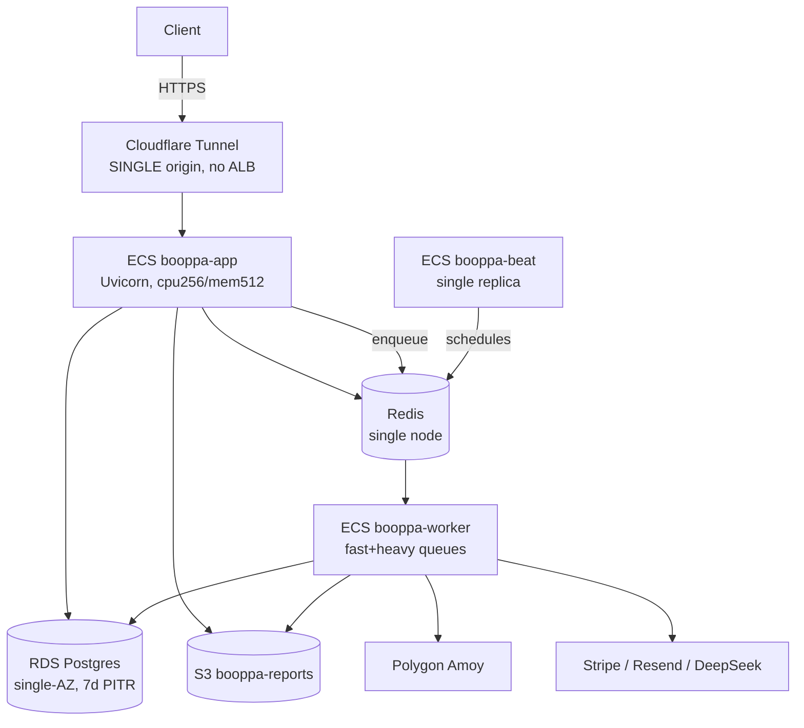

# Production Readiness Audit — Booppa Backend (2026-07-17)

Scope target for this review: **millions of requests/day, zero data loss, HA, continuous deploy.**
Every finding cites evidence. Where the codebase is silent, it says so.

> **Important context (verified via project memory `prod_readiness_remediation`):** A prior
> remediation already landed (Phase 1–3): entrypoint migration fail-fast, scoped IAM task role,
> Celery worker/beat split, CI test gate, secrets moved to Secrets Manager, RDS 7-day PITR backups +
> deletion protection. **Multi-AZ / Redis HA were *deliberately deferred* to hold a Lean Mode
> <$80/mo budget.** This audit is written against the *stated large-scale target*, so it re-flags
> those deferrals as blockers **for that target** — they remain a legitimate, documented trade-off at
> current scale. `infra/terraform/*.tf` is **drifted reference-only**; `.github/workflows/ci.yml` is
> the source of truth for the live ECS stack.

---

## Phase 1 — Application Assessment

**Runtime / framework:** Python 3.11, FastAPI 0.104.1 on Uvicorn (`Dockerfile`, `requirements.txt`),
dual-mounted router at `/api/v1` and `/api` (`app/main.py:87-88`). Also exposes a Mangum Lambda
handler (`app/main.py:95`) though the live deploy is ECS Fargate.

**Services (live, per `ci.yml`):**
- `booppa-app` — FastAPI API (ECS Fargate, cpu 256 / mem 512 default — `ci.yml:279-291`).
- `booppa-worker` — Celery worker consuming `fast_queue` + `heavy_queue` (`ci.yml:447-461`, more memory for Chromium).
- `booppa-beat` — dedicated single-replica Celery beat (`ci.yml:540-552`).
- `booppa-cms` — Django admin.
- `cloudflared-tunnel` — Cloudflare Tunnel is the **ingress** (`task-def-cloudflared-out.json`); there is **no ALB in the live path**.

**Data stores:** PostgreSQL on RDS (`booppa-postgres`, single-AZ), Redis (broker + result backend +
cache + rate-limit store — `CLAUDE.md`, `app/core/limiter.py`), S3 (`booppa-reports`).

**Async / scheduled:** Celery on Redis, two queues; ~14 beat cronjobs (`app/workers/celery_app.py`).

**External APIs:** Stripe, Resend/SES, Polygon Amoy (web3), DeepSeek/OpenAI/Anthropic, VirusTotal, ACRA, GeBIZ.

**Auth:** JWT with type discrimination + bcrypt + `bp_`-prefixed API keys (`app/core/db.py`, `app/core/auth.py`).

### Dependency map

---

## Phase 2 — Production Readiness Audit

### Reliability
- **`/health` is a static 200** (`app/main.py:73-76`) — returns healthy regardless of DB/Redis state.
  It is neither a real readiness nor liveness probe. Under a DB outage the endpoint still reports green.
- **No ECS container-level `healthCheck`** in the generated task defs (`ci.yml:284-370` app block has no
  `healthCheck` key). The Dockerfile `HEALTHCHECK` (curl `/health`) is **ignored by ECS** unless
  restated in the task def. Consequence: `aws ecs wait services-stable` (`ci.yml:838`) only confirms the
  task reached RUNNING, **not that it serves traffic** — a boot-broken image can be declared "stable."
- **No deployment circuit breaker / auto-rollback.** No `deploymentConfiguration` with
  `deploymentCircuitBreaker.rollback` anywhere in `ci.yml`. A bad deploy stays live; recovery is manual.
- **SPOF chain for the stated target:** single Cloudflare Tunnel origin → (likely) single app task
  (no `desiredCount` set in CI — *insufficient evidence* it's >1), single-AZ RDS, single Redis. All are
  documented Lean-Mode trade-offs but are hard blockers at "millions/day, HA."
- **Positives:** Celery `task_acks_late=True`, `task_reject_on_worker_lost=True`,
  `worker_max_tasks_per_child=100` (`app/workers/celery_app.py:23-26`) — correct at-least-once posture.
  Note this **requires task idempotency**; the all-products bug audit found several fulfillment paths
  that were not idempotent/were swallowing errors (now partially remediated). DB sessions use
  `pool_pre_ping=True` + `transactional_session()` context manager (`app/core/db.py`).
- **Migrations** are opt-in (`RUN_MIGRATIONS_ON_BOOT=0` default, `entrypoint.sh`) and run as a one-off
  ECS task gated behind manual `workflow_dispatch` `run_migrations=true` (`ci.yml:621-690`). Good (no
  replica race) but introduces **schema-drift risk if an author forgets** to flip the flag for a
  migration-bearing deploy — the new image boots against an old schema.

### Security
- **CI has zero security scanning** — no image vuln scan (Trivy/ECR scan-on-push), no dependency
  audit (`pip-audit`/safety), no SAST. Confirmed: grep for trivy/pip-audit/bandit/snyk/safety in
  `.github/workflows/*.yml` returns nothing.
- **`stripe` is unpinned** in `requirements.txt:39` (also `playwright`, `openpyxl`, `django-ckeditor`,
  `email-validator`). Unpinned payment SDK = non-reproducible builds + supply-chain exposure.
- **`/metrics` is exposed without auth** (`Instrumentator().instrument(app).expose(app)`,
  `app/main.py:42`). It's behind the tunnel, but if `api.booppa.io/metrics` is reachable it leaks
  request/latency internals. Restrict by network or token.
- **Rate limiting is effectively bypassed behind the tunnel.** `slowapi` keys on
  `get_remote_address` (`app/core/limiter.py`) = `request.client.host`, and Uvicorn is **not started
  with `--proxy-headers`/`--forwarded-allow-ips`** (`entrypoint.sh`, `docker-compose.yml`). Behind
  Cloudflare Tunnel every request presents the tunnel's IP, so the `200/minute` limit is **global, not
  per-client** — a single abuser exhausts everyone's budget, and per-IP protection doesn't work.
- **Positives:** secrets are in Secrets Manager referenced via `valueFrom` (`ci.yml:355-368`), OIDC
  federation for AWS (no static keys in CI), CORS locked to explicit origins in prod
  (`ALLOWED_ORIGINS`, `ci.yml`), non-root container user `booppa` (`Dockerfile`), least-priv scoped task
  role, `SECRET_KEY` default-value guard fails boot in prod (`app/core/config.py:192`), docs disabled in
  prod (`app/main.py:34-35`). `.env` is gitignored.
- **Hygiene risk:** `celery.log` (38 KB) is committed at repo root (not in `.gitignore` — only
  `celerybeat-schedule` is). Logs can carry request/PII fragments. ~30 `fix_*.py`/`patch_*.py`/
  `update_*.py` one-off scripts and root-level `test_*.py` are also committed — enlarges the image and
  the attack/confusion surface.

### Scalability
- **App is largely stateless** (JWT auth, Redis-backed cache/rate-limit) → horizontally scalable *in
  principle*, but the **Cloudflare Tunnel single-origin ingress + no ALB** means there is no load
  balancer to spread replicas. Horizontal scale-out is not wired.
- **No autoscaling** evidence (no `application-autoscaling` / target-tracking in `ci.yml`). *Insufficient
  evidence* that any ASG/Service Auto Scaling exists.
- **10× traffic:** at cpu 256/mem 512 single task, the API saturates CPU quickly; DB pool is 5+5=10
  conns/task. **100× / regional outage:** single-AZ RDS + single Redis = full outage, no failover
  (accepted Lean-Mode trade-off). **DB slowdown:** no circuit breaker/timeout on DB calls beyond pool
  timeout 30s → request threads pile up, `/health` stays green, cascading latency.

### Performance
- **API image ships Playwright + full Chromium runtime** (`Dockerfile` installs chromium + ~25 X libs).
  The API doesn't need Chromium (only the worker/PDPA scanner does) — this bloats the API image, slows
  cold starts and pulls. Consider a separate slimmer API image or a shared base with browser layers only
  on the worker.
- Single-stage build, `--no-cache-dir` pip (good), but no multi-stage separation of build deps
  (`build-essential`, `libpq-dev`, `git`) from the runtime image — they stay in the final layer.
- No CDN/compression config evident for static assets; `prometheus-fastapi-instrumentator` present is a plus.

---

## Phase 3 — Infrastructure Design (target-state, minimal)

Only what the stated target justifies, kept as close to the current ECS shape as possible:

- **Ingress:** Add an **internal ALB** in front of `booppa-app` with a target-group health check on a
  real readiness endpoint; keep Cloudflare Tunnel pointed at the ALB (not a single task). This unlocks
  multi-replica + rolling deploys with health gating.
- **App tier:** `desiredCount ≥ 2` across 2 AZs + ECS Service Auto Scaling (target-tracking on CPU/ALB
  RequestCountPerTarget).
- **DB:** RDS Multi-AZ (failover) — the one durability gap Phase 3 explicitly deferred.
- **Cache/broker:** ElastiCache Redis with a replica + automatic failover, or split broker (SQS) from
  cache if you want to decouple task delivery from cache availability.
- **Object storage/CDN:** S3 (present) + CloudFront for public static/download assets.
- **Observability:** managed Prometheus/Grafana or CloudWatch + an error tracker (Sentry).

---

## Phase 4 — CI/CD Pipeline

Current (`ci.yml`): test gate → ECR build/push (SHA + latest) → sync secrets → register task defs →
optional gated migrations → `update-service --force-new-deployment` → `wait services-stable`.

**Add, in order:** dependency audit (`pip-audit`) → SAST (`bandit`) → **container scan** (Trivy or ECR
enhanced scanning, fail on HIGH/CRITICAL) → build → **push SHA tag only for prod refs** → deploy to a
**staging** service → **smoke test** (hit real `/ready`) → prod deploy with **deployment circuit breaker
+ rollback** → post-deploy smoke. Pin `stripe` and the other unpinned deps first so scans are meaningful.

**Rollback:** enable `deploymentConfiguration.deploymentCircuitBreaker={enable:true,rollback:true}` on
each service so a failed health-gated deploy auto-reverts to the last good task def, instead of the
current manual recovery.

---

## Phase 5 — Containerization

- Move to a **multi-stage build**: builder stage for `build-essential`/`libpq-dev`/wheels, slim runtime
  stage. Drop `git` from the runtime image.
- **Do not install Chromium in the API image** — only the worker needs it. Split Dockerfiles or use a
  build target.
- Add ECS task-def `healthCheck` and a `stopTimeout` for graceful shutdown; today there's no explicit
  shutdown drain for in-flight requests (`app/main.py` has a startup hook but no shutdown hook).
- Positives already in place: non-root user, `PYTHONUNBUFFERED`, pinned base `python:3.11-slim`.

---

## Phase 6 — Kubernetes: **Not justified.**

ECS Fargate + a handful of services is the right fit and already in production. K8s would add
operational burden with no benefit at this scale and contradicts the Lean-Mode constraint. Stay on ECS;
the missing pieces (ALB, autoscaling, circuit breaker) are all native ECS features, not reasons to migrate.

---

## Phase 7 — Monitoring & Observability

- **Metrics:** `prometheus-fastapi-instrumentator` exposes `/metrics` (present) — scrape it (secured),
  add DB pool, Celery queue depth, and Stripe-fulfillment success/failure counters.
- **Logging:** structured JSON logging is set up (`setup_json_logging`, `app/main.py:24`) with a
  `RequestIDMiddleware` correlation ID — good. Ship to CloudWatch Logs (already the log driver) with a
  retention policy and a metric filter on ERROR.
- **Tracing:** OpenTelemetry API/SDK are in `requirements.txt` but *insufficient evidence* they're
  wired to an exporter — finish the OTEL exporter config for distributed traces.
- **Error tracking:** **none** (no Sentry). Add one — swallowed-exception fulfillment bugs (see the
  all-products audit) are exactly what an error tracker surfaces.
- **Alerting:** *Insufficient evidence of any alerting.* Add alerts on: 5xx rate, p95 latency, DB
  connection failures/pool exhaustion, Celery queue backlog, Redis memory, cert expiry, failed
  deploys, and `_alert_payment_fulfillment_issue` firing.

---

## Phase 8 — Deployment Strategy

**Recommended: rolling deploy with a health-gated ALB target group + deployment circuit breaker.** It
fits a stateless FastAPI service and is native to ECS with zero extra infra once an ALB exists. Once
`desiredCount ≥ 2`, `minimumHealthyPercent=100` / `maximumPercent=200` gives zero-downtime rollouts.
Canary/blue-green are overkill for current scale. **Rollback procedure:** with the circuit breaker
enabled, failed deploys auto-revert; manual fallback is
`aws ecs update-service --task-definition <last-good-arn> --force-new-deployment`.

---

## Phase 9 — Disaster Recovery

- **Backups (present):** RDS 7-day automated backups + PITR (~5 min RPO) + deletion protection + final
  snapshot (Phase 3). Good for the DB.
- **Gaps:** single-AZ = no automatic AZ-outage survival (**RTO = manual restore, tens of minutes to
  hours**). Redis has **no durability guarantee in prod** (compose uses `appendonly yes`, but live
  ElastiCache persistence/replica is *insufficient evidence* / deferred) — Redis loss drops in-flight
  Celery tasks and cached RFP kits. **No documented multi-region.** S3 versioning/replication:
  *insufficient evidence.*
- **RPO/RTO:** DB RPO ≈ 5 min (good). App/infra RTO is manual and undefined for an AZ outage.
- **Actions:** Multi-AZ RDS, ElastiCache with replica, enable S3 versioning on `booppa-reports`, and
  write an AZ-outage runbook (one already exists for RDS durability — extend it).

---

## Phase 10 — Production Deployment Checklist

> **Remediation status (2026-07-17):** items 1, 2, 4, 5, 6, 7, 8 implemented in this pass
> (see "Remediation applied" below). Items 3, 9, 11, 12 remain open by design/scope.

### 🔴 Critical (fix before "millions/day, HA")
1. ✅ **Real readiness probe** — `GET /ready` checks DB + Redis and returns **503** on failure
   (`app/main.py`), wired to an **ECS container `healthCheck`** (`curl /ready`) in the app task-def
   (`ci.yml`). `/health` remains the cheap liveness probe. (ALB target-group health-gating still
   pending an ALB; container health check + circuit breaker now gate the rollout.)
2. ✅ **Deployment circuit breaker + auto-rollback** on the app service via
   `--deployment-configuration deploymentCircuitBreaker={enable=true,rollback=true}` (`ci.yml`).
3. ⏳ **Multi-AZ RDS + HA Redis** (deferred Lean-Mode items) — **document-only** this pass; see
   *HA remediation runbook* below. Required for the HA target; a cost decision, not a code change.
4. ✅ **Rate limiting behind the tunnel fixed** — Uvicorn started with
   `--proxy-headers --forwarded-allow-ips "*"` (`entrypoint.sh`) and `slowapi` keyed on the
   left-most `X-Forwarded-For` entry (`app/core/limiter.py`).
5. ✅ **CI security scanning added + deps pinned** — `pip-audit`, `bandit`, and a **Trivy** image
   scan gate the deploy (`.github/workflows/ci.yml`); `stripe==15.1.0` and other floats pinned
   (`requirements.txt`).
6. ✅ **`/metrics` secured** — closed by default (404 unless `METRICS_TOKEN` is set), then requires
   a bearer/`?token=` match (`app/main.py`).

### 🟠 High priority
7. ✅ **Error tracker (Sentry)** wired opt-in — inits only when `SENTRY_DSN` is set
   (`app/main.py`, `sentry-sdk[fastapi]==1.45.0`). **Alerting** on 5xx/latency/queue-depth/
   pool-exhaustion/fulfillment failures still to be configured in the metrics backend.
8. ✅ **Graceful shutdown** — FastAPI `shutdown` hook cancels the WebSocket relay task and disposes
   the SQLAlchemy engine (`app/main.py`). Pair with ECS `stopTimeout` for the full drain window.
9. **App autoscaling** (Service Auto Scaling) once an ALB exists — open.
10. **Migration-safety guard**: detect pending migrations at deploy time and fail the pipeline if the
    image ships a migration but `run_migrations` wasn't set — see *migration-drift note* below.
11. **Multi-stage Dockerfile** + remove Chromium from the API image — **document-only** this pass; see
    *Chromium image-split runbook* below.
12. Finish **OpenTelemetry** exporter wiring (deps already present) — open.

### 🟢 Nice to have
13. Remove committed `celery.log` (add to `.gitignore`) and archive the ~30 root `fix_*/patch_*/update_*`
    and `test_*.py` one-off scripts out of the deploy image.
14. CloudFront in front of S3 public downloads.
15. S3 versioning/replication on `booppa-reports`.

---

### Verified vs. assumed
- **Verified:** all `path:line` / config citations above.
- **Insufficient evidence to conclude:** live `desiredCount`/replica count; live ElastiCache
  persistence & replica; ECS Service Auto Scaling existence; OTEL exporter wiring; S3 versioning; any
  alerting stack. (`ci.yml` sets task defs and forces deployments but does not manage service
  scaling/HA settings, and `infra/terraform` is drifted reference-only.)

---

## Remediation applied (2026-07-17)

Code/CI/config changes made in this pass (no infra mutated, no deploy triggered):

| Item | Files |
|------|-------|
| `/ready` probe (DB+Redis, 503) + liveness `/health` | `app/main.py` |
| ECS container `healthCheck` on app task-def | `.github/workflows/ci.yml` |
| Deployment circuit breaker + rollback | `.github/workflows/ci.yml` |
| Uvicorn `--proxy-headers --forwarded-allow-ips` | `entrypoint.sh` |
| XFF-aware rate-limit key | `app/core/limiter.py` (+ import cleanup in `app/main.py`) |
| `pip-audit` + `bandit` + Trivy CI gates | `.github/workflows/ci.yml` |
| Pin `stripe==15.1.0`, `playwright`, `openpyxl`, `django-ckeditor`, `email-validator`; add `sentry-sdk` | `requirements.txt` |
| `/metrics` token gate (closed by default) | `app/main.py`, `app/core/config.py` (`METRICS_TOKEN`) |
| Sentry opt-in init | `app/main.py`, `app/core/config.py` (`SENTRY_DSN`) |
| Graceful-shutdown drain | `app/main.py` |

**New optional env vars** (inert if unset): `SENTRY_DSN`, `SENTRY_TRACES_SAMPLE_RATE`, `METRICS_TOKEN`.
Set `METRICS_TOKEN` and a scraper bearer to re-enable Prometheus scraping; set `SENTRY_DSN` to turn on
error tracking. Both should be added to the Secrets Manager sync + app task-def `secrets[]` when adopted.

---

## HA remediation runbook (item 3 — document-only, Lean-Mode deferred)

These are the deferred single-AZ SPOFs. Both are toggles, not rewrites, but each raises the monthly
bill above the <$80/mo Lean-Mode target — hence a deliberate cost decision, not applied here. **Do not
`terraform apply`** — `infra/terraform` is drifted; make these changes against the live resources.

- **RDS Multi-AZ:** enable Multi-AZ on the live instance (`aws rds modify-db-instance
  --multi-az --apply-immediately`, or a maintenance window). RPO stays at the current PITR/backup
  window; RTO drops to ~60–120s automatic failover. Cost: ~2× the DB instance-hours.
- **Redis HA:** migrate the single ElastiCache node to a **replication group** with `automatic-failover`
  and ≥1 replica in a second AZ (Redis is broker + result backend + cache + rate-limit store, so its
  loss halts fulfillment). Cost: +1 node-hour. Confirm `appendonly`/snapshot policy on the live node
  first — *insufficient evidence in-repo*.

## Chromium image-split (item 11 — DONE 2026-07-17)

The API image used to ship Playwright Chromium + ~25 X libs, but only the **worker** (PDPA scanner
headless renders + fulfillment screenshots) needs it. Implemented as a two-image split:

1. **`Dockerfile`** (`booppa-app`, the public/internet-facing image) — Chromium apt libs and the
   `playwright install` step removed; `playwright` dropped from `requirements.txt`. This is the image the
   CI Trivy gate scans, so all 15 Playwright-bundled Node findings + the mesa/`libgbm1` OS CRITICALs
   leave the scanned surface. The API screenshot path (`app/api/qr_scan.py`) degrades gracefully to
   public providers — `screenshot_service` catches the Playwright `ImportError` and falls through.
2. **`Dockerfile.worker`** (new, `booppa-worker`) — `FROM ${BASE_IMAGE}` (the freshly-built
   `booppa-app:<sha>`, passed as a build-arg) then re-adds the Chromium libs + `playwright install`
   from `requirements-worker.txt`. Worker **and** beat task-defs point at this image (beat derives from
   the worker task-def via `jq`, so it inherits it).
3. **`ci.yml`** — new `WORKER_ECR_REPO=booppa-worker` env, an idempotent `ensure worker ECR repo`
   step, a `Build & push worker image` step (after the app Trivy scan, so it layers on the scanned
   base), and the worker task-def `APP_IMAGE` repointed to the worker repo.

The worker image is intentionally **not** on the Trivy gate — it is internal-only (no inbound from the
Cloudflare Tunnel), so its Chromium CVE surface is accepted rather than blocking deploys.

**One-time prerequisite:** the `booppa-worker` ECR repo. CI creates it on first run via the
`ensure worker ECR repo` step; no manual Console action needed.

## Migration-drift note (item 10)

Migrations apply via the dedicated gated CI one-off ECS task (`ci.yml`), while `entrypoint.sh` keeps an
opt-in `RUN_MIGRATIONS_ON_BOOT` (default 0, fail-fast). Keep migrations **solely** in the CI task; the
per-replica boot flag is a break-glass, not the norm (racing replicas on `alembic upgrade head` is
unsafe). Recommended follow-up: a CI check asserting `alembic heads` == the DB head after the migration
task, failing the pipeline on drift. Not implemented this pass (no code change requested for item 10).
