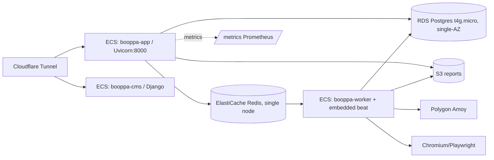

# Booppa Backend — Production Readiness Audit

**Scope:** `booppa_backend` (FastAPI + Celery), target: millions req/day, business-critical, zero data loss.
**Verdict:** **NOT production-ready for millions/day as-is.** Solid application-layer foundations (structured
logging, Prometheus, request IDs, rate limiting, non-root container, Secrets Manager for DB). But there are
**critical secrets-handling, HA, data-durability, and CI-gating gaps** that must be fixed first.

Every finding cites `path:line` or a named config. Assumptions are labelled.

---

## Phase 1 — Application Assessment (deployment dependency map)

**Runtime:** Python 3.11, FastAPI (`app/main.py`), served by Uvicorn on :8000 (`entrypoint.sh:21`).
ASGI, single-process per container. Also exposes a Mangum Lambda handler (`main.py` tail) — unused in ECS.

**Components (all from one image, `Dockerfile`):**
- **API** — `uvicorn app.main:app` (ECS service `booppa-app`).
- **Worker** — Celery, `-Q fast_queue,heavy_queue` with **embedded beat `--beat`** (ci.yml:402; ECS service `booppa-worker`).
- **CMS** — Django admin (`cms_admin/`, ECS service `booppa-cms`), EFS-backed media volume (ci.yml:500-508).
- **Cloudflared** — Cloudflare Tunnel in Fargate is the public ingress (per CLAUDE.md / `task-def-cloudflared-out.json`); TLS terminates at Cloudflare.

**Stateful dependencies:**
- **Postgres** — RDS `db.t4g.micro` (`main.tf:60`). SQLAlchemy pool 5 + overflow 5 per task (ci.yml:209-210).
- **Redis** — ElastiCache single node `cache.t4g.micro`, `num_cache_nodes=1` (`main.tf:88-92`). Celery broker **and** result backend.
- **S3** — `booppa-reports*`, AES256 SSE, private ACL (`main.tf:29-40`). Presigned URLs, 7-day expiry.

**External APIs:** Stripe, Resend/SES, Polygon Amoy (blockchain anchoring), DeepSeek/Anthropic/OpenAI, VirusTotal, EU sanctions XML, Playwright/Chromium headless (PDPA scanner).

**Scheduled jobs:** ~14 Celery-beat crons (`app/workers/celery_app.py`) — GeBIZ sync /30 min, monthly PDPA rescans, weekly vendor digests, etc.

**Auth:** JWT with type discrimination (`app/core/auth.py`), bcrypt passwords. Stateless → good for horizontal scale.

---

## Phase 2 — Production Readiness Audit

### 🔴 Security

1. **App secrets injected as plaintext env in the ECS task def** — `ci.yml:227-294` (app) and `:403-464`
   (worker) write `STRIPE_SECRET_KEY`, `BLOCKCHAIN_PRIVATE_KEY`, `SECRET_KEY`, `CSP_PII_KEY_LOCAL`,
   `CSP_PII_SEARCH_PEPPER`, `ADMIN_PASSWORD`, `CMS_ADMIN_TOKEN` into `containerDefinitions[].environment`.
   Only `DATABASE_URL` uses the `secrets`/Secrets Manager path (`ci.yml:296-298`). **Anyone with
   `ecs:DescribeTaskDefinition` can read every secret in plaintext**, and they land in CloudTrail/console.
   For a product holding PII with a `CSP_PII_KEY_LOCAL` encryption key, this also weakens the encryption-at-rest story.
2. **`.env` holds live, high-value secrets in the working tree** — verified keys present: `AWS_ACCESS_KEY_ID=AKIA…`,
   `AWS_SECRET_ACCESS_KEY`, `BLOCKCHAIN_PRIVATE_KEY`, `DEPLOY_PRIVATE_KEY`, `ADMIN_PASSWORD`, `CSP_PII_KEY_LOCAL`.
   It is **gitignored** (`.gitignore:51`, `git ls-files` confirms untracked) — good — but a long-lived static
   IAM user key on a laptop is a standing compromise risk. Rotate to short-lived roles; the two blockchain
   private keys are identical (`BLOCKCHAIN_PRIVATE_KEY == DEPLOY_PRIVATE_KEY`) — a deploy key doubling as the
   signing key is over-privileged.
3. **Over-broad task-role IAM** — `iam.tf:29-31,34-36,44-46` attach `AmazonS3FullAccess`, `AmazonSESFullAccess`,
   **`SecretsManagerReadWrite`** (write!), `CloudWatchLogsFullAccess` to the task role. Comment even says
   "adjust to least privilege later" (`iam.tf:28`). A scoped inline policy (`booppa-task-policy.json`) exists
   but is **not attached by any `.tf`**. `SecretsManagerReadWrite` on the app role means a compromised request
   handler can rewrite every secret in the account.
4. **RDS storage not encrypted** — `main.tf:60-72` sets no `storage_encrypted = true`. Default is unencrypted.
   PDPA/PII data at rest unencrypted is a compliance gap.
5. **ALB listener is HTTP-only** — `alb.tf:76-86` defines only a port-80 listener/SG; no 443 listener wired to
   the ACM cert. *Assumption:* real ingress is Cloudflare Tunnel so the ALB is largely vestigial (`create_alb`
   default `false`, `variables.tf`), but if the ALB is ever used it terminates plaintext.
6. **No dependency / image / secret scanning** anywhere in CI (see CI section).
7. `docs`/`redoc` correctly disabled in prod (`main.py:34-35`). CORS is allow-listed to booppa domains
   (`ci.yml:283`) with `allow_credentials=True` — acceptable. `SECRET_KEY` default is guarded with a fatal
   check (`config.py:175-179`) — good.

### 🔴 Reliability

1. **Migrations run on every container boot, failure swallowed** — `entrypoint.sh:12-15`:
   `alembic upgrade head || echo "…continuing"`. With >1 app task, **N tasks race the same migration**; and a
   failed migration still boots the app against a half-migrated schema. CI *also* has a proper one-off migration
   path (`ci.yml:543-611`) — the two mechanisms conflict. Boot-time migration must be removed for multi-replica.
2. **Embedded Celery beat blocks worker horizontal scaling** — worker command is `--beat` (`ci.yml:402`). Beat
   must be a **singleton**; running 2+ worker replicas fires **every cron twice** (double PDPA rescans, double
   billing digests, double GeBIZ sync). Today `desired_count = 1` (`ecs.tf`, worker), so the worker is a **SPOF**
   and cannot scale. All heavy fulfillment (PDF, blockchain, S3) stops if that one task dies.
3. **App is a SPOF at defaults** — `app_desired_count` default `1` (`variables.tf`).
4. **Shallow health check** — `/health` returns static JSON (`main.py:71-74`); it does not probe DB or Redis.
   The ALB target group (`alb.tf:64`) and Fargate healthcheck (`Dockerfile` HEALTHCHECK) will keep a task
   "healthy" while it cannot reach Postgres/Redis. No readiness-vs-liveness distinction.
5. **Single Redis node = task/result loss** — `main.tf:88-92`, `num_cache_nodes=1`, no replication/failover.
   Redis is broker + backend; a node replacement drops all in-flight and queued Celery messages. No AOF/RDB
   persistence configured on ElastiCache.
6. **No graceful-shutdown budget for long tasks** — Fargate SIGTERM → default 30s stop timeout; heavy PDF/anchor
   tasks can exceed this and be killed mid-flight. Retries mitigate but no `stopTimeout` is set in the task defs.

### 🟠 Scalability

- **DB connection ceiling** — `db.t4g.micro` (~85-112 max_connections) vs 10 conns/app-task → **~8 app tasks max**
  before exhaustion; no PgBouncer. Hard cap well below "millions/day".
- **Socket.IO is single-instance** — `websocket.py:10` `socketio.AsyncServer(...)` with **no `client_manager`/
  Redis message queue**, plus an in-process `start_event_relay()` asyncio task (`main.py:66`). Fan-out breaks
  across >1 app replica (clients on task A never see events emitted on task B). Needs the Redis manager or sticky routing.
- **Rate limiting is per-instance** — `limiter.py:4` `Limiter(key_func=get_remote_address, default_limits=["200/minute"])`
  with **no `storage_uri`** → in-memory. Global limit = 200 × replica_count, and resets on redeploy. Move to Redis storage.
- App/JWT auth is stateless → scales fine once the above are fixed.

### 🟠 Performance

- **One fat image for API and worker** — `Dockerfile` installs `build-essential`, `git`, and **Playwright Chromium**
  (+~30 apt libs) into the single image the API also runs. The API doesn't need Chromium/build tools → slower cold
  starts, larger attack surface, bigger ECR pulls. Multi-stage build + separate worker image recommended.
- API task is `256 CPU / 512 MB` (ci.yml:207-208) — very small; Chromium worker at `512/1024` (ci.yml:381-382)
  is tight for headless Chrome. No autoscaling targets defined anywhere.

**What happens under load:**
- **10×:** DB connections exhaust (~8 app tasks), Socket.IO fan-out fragments, per-instance rate limits drift. Degraded.
- **100×:** Not attainable without RDS scale-up/PgBouncer, worker fleet + externalized beat, Redis HA. Would fail.
- **Regional/AZ outage:** RDS single-AZ (`main.tf` `multi_az` default false), single Redis node, single NAT
  (`vpc.tf:73-77`) → **hard outage / data-at-risk**.
- **DB slowdown:** No circuit breaker; shallow health check keeps routing traffic; pool timeout 30s → request pileup.

---

## Phase 3 — Infrastructure Design (target state)

- **RDS Postgres:** Multi-AZ, `storage_encrypted=true`, `backup_retention_period≥7`, `deletion_protection=true`,
  `skip_final_snapshot=false`, Performance Insights. Add **RDS Proxy** (or PgBouncer sidecar) for pooling.
- **ElastiCache Redis:** replication group, ≥2 nodes across AZs, automatic failover, encryption in transit/at rest.
  *Consider* splitting Celery broker (SQS) from result backend if durability of results matters.
- **ECS Fargate:** app min 2 tasks across AZs + Application Auto Scaling (target-tracking on CPU + ALB req/target).
  Worker fleet ≥2 with **beat externalized** (dedicated 1-replica beat service, or CloudWatch EventBridge → run-task).
- **Networking:** NAT gateway per-AZ (remove single-NAT SPOF), private subnets for tasks/DB/Redis (already private).
- **Secrets:** all app secrets → Secrets Manager `valueFrom`, not plaintext env. Scope task role least-privilege.
- **CDN:** Cloudflare already fronts ingress; keep. Serve report downloads via presigned S3 (already done).
- **Observability:** Prometheus scrape of `/metrics` (already instrumented), CloudWatch logs (already), add alarms.

---

## Phase 4 — CI/CD Pipeline

**Current (`.github/workflows/`):**
- `test.yml` — pytest + coverage on push/PR to main, Postgres+Redis services, alembic. **Good.**
- `ci.yml` — on **push to main**: build → push ECR → register task defs → deploy → `wait services-stable`.
  **`ci.yml` does not depend on `test.yml`** — deploy proceeds even if tests fail. **No lint, no SAST, no
  dependency scan, no image/CVE scan, no staging, no smoke test, no automated rollback** (only `wait
  services-stable`). `permissions: write-all` (`ci.yml:39`) is over-broad.

**Target pipeline (gates in order):** lint/format → `pytest` (must pass, block deploy) → `pip-audit`/Dependabot →
build → **Trivy/ECR scan on image (fail on HIGH/CRITICAL)** → push → deploy to **staging** → smoke test
(`/health` + one auth + one Stripe test-mode flow) → deploy prod (rolling) → post-deploy smoke → auto-rollback
to previous task-def ARN on failed `wait services-stable`. Recommend keeping GitHub Actions (already invested);
add `needs: [pytest]` and scanning jobs. Scope `permissions` down.

---

## Phase 5 — Containerization

`Dockerfile` positives: non-root `booppa` uid 1001, `PYTHONUNBUFFERED`, pinned base `python:3.11-slim`, HEALTHCHECK.
Fixes: **multi-stage** (build wheels in a builder, copy into slim runtime — drop `build-essential`, `git`,
`pkg-config` from runtime); **separate worker image** carrying Chromium so the API image is lean; pin apt/pip
versions for reproducibility; add `stopTimeout` in task defs for worker drain.

---

## Phase 6 — Kubernetes?

**Not justified.** The app is already on ECS Fargate with a working GitHub Actions → ECR → ECS pipeline. Fargate
covers autoscaling, per-task isolation, and rolling deploys without cluster ops overhead. Kubernetes would add
control-plane and operational burden with no offsetting benefit at this stage. **Stay on ECS Fargate**; revisit
only if multi-cloud, complex service mesh, or heavy per-team multi-tenancy emerges.

---

## Phase 7 — Monitoring & Observability

**Already present:** structured JSON logging (`main.py:22` `setup_json_logging`), request-ID middleware
(`RequestIDMiddleware`), Prometheus instrumentation exposing `/metrics` (`main.py:41`), CloudWatch log groups
per service. Good baseline.

**Gaps / add:**
- **Metrics/alarms:** scrape `/metrics` (Prometheus/Grafana or CloudWatch agent). Alarms: 5xx rate, p95 latency,
  RDS CPU/connections/free-storage, Redis evictions/CPU, **Celery queue depth & task failure rate**, ECS running-vs-desired.
- **Health depth:** add a `/ready` that checks DB + Redis; keep `/health` shallow for liveness.
- **Tracing:** `GRAFANA_OTEL_ENDPOINT` exists in config (`config.py:84`) but no OpenTelemetry wiring found — add
  request tracing to correlate API → worker → external calls.
- **Alerting on fulfillment:** the code already has `_alert_payment_fulfillment_issue` — route it to PagerDuty/Slack
  and alarm on it (paid-but-unfulfilled is a revenue/trust incident).
- **Cert/expiry & failed-deploy** alarms.

---

## Phase 8 — Deployment Strategy

ECS rolling deploy is currently used (`--force-new-deployment` + `wait services-stable`). Recommended: keep
**rolling** for app with `minimumHealthyPercent=100/maximumPercent=200` and a **deep** ALB/target health check so
bad tasks never receive traffic. Add **automated rollback**: capture previous task-def ARN, and on failed
`wait services-stable` re-`update-service` to it. For the worker, deploy beat separately and drain with a
`stopTimeout`. Blue/green (CodeDeploy) is a nice-to-have later; not required at this stage.

---

## Phase 9 — Disaster Recovery

**Current RPO/RTO: effectively undefined and at-risk.**
- **RDS:** `skip_final_snapshot=true` (`main.tf:66`), no `backup_retention_period`, no `deletion_protection`,
  single-AZ. A DB delete/failure risks **total data loss**. → set retention ≥7d + PITR, deletion protection,
  final snapshot, Multi-AZ. Target **RPO ≤5 min (PITR), RTO ≤1 h**.
- **Redis:** single node, no persistence → in-flight/queued tasks lost on failure. Tasks are retryable, so tolerable
  once broker is HA; make failover automatic.
- **S3:** AES256 SSE, private (`main.tf:33-38`). Add **versioning** + lifecycle for the reports bucket to guard
  against accidental overwrite/delete (evidence documents are the product).
- **Infra:** Terraform state committed locally (`infra/terraform/terraform.tfstate*` present) — **move to remote
  encrypted S3 backend + DynamoDB lock**; local state is a DR and concurrency hazard.
- **Multi-region:** none. Acceptable for now; document as a known single-region risk.

---

## Phase 10 — Production Deployment Checklist

### 🔴 Critical (must fix before production)
1. Move **all** app/worker secrets to Secrets Manager `valueFrom`; stop writing them as plaintext `environment`
   (`ci.yml:227-294`, `:403-464`). Rotate every secret currently exposed there and in `.env` (esp. AWS key,
   `BLOCKCHAIN_PRIVATE_KEY`, `CSP_PII_KEY_LOCAL`).
2. Scope the ECS **task role to least privilege**; drop `SecretsManagerReadWrite`/`*FullAccess`; attach the
   existing `booppa-task-policy.json` (`iam.tf:27-46`).
3. **RDS durability:** `storage_encrypted`, `backup_retention_period≥7`, `deletion_protection`,
   `skip_final_snapshot=false`, **Multi-AZ** (`main.tf:60-72`).
4. **Redis HA:** replication group with automatic failover (`main.tf:88-92`).
5. Remove **boot-time `alembic upgrade`** from `entrypoint.sh:12-15`; run migrations only as the CI one-off gate.
6. **Externalize Celery beat** from the worker command (`ci.yml:402`) so workers can scale to ≥2 without duplicate crons.
7. **Gate deploys on tests**: make `ci.yml` require `test.yml` (`needs:`) — no deploy on red.
8. Run app & worker with **≥2 tasks across AZs**; **per-AZ NAT** (`vpc.tf:73-77`).
9. S3 reports bucket **versioning**; Terraform **remote state**.

### 🟠 High priority
- Deep `/ready` health check (DB+Redis); ALB uses it.
- Redis-backed rate limiting (`limiter.py:4`) and Socket.IO Redis manager (`websocket.py:10`).
- RDS Proxy / PgBouncer for connection pooling.
- CI: image CVE scan (Trivy), `pip-audit`, staging + smoke tests, automated rollback, narrow `permissions`.
- Application Auto Scaling targets for app (and worker by queue depth).
- Alarms: 5xx, latency, RDS/Redis, Celery queue depth/failures, unfulfilled-payment alert.
- Multi-stage Dockerfile; separate lean API image from Chromium worker image.

### 🟢 Nice to have
- OpenTelemetry tracing (endpoint stub already in `config.py:84`).
- Blue/green via CodeDeploy.
- Multi-region DR plan.
- HTTPS listener on ALB if it ever becomes a fallback ingress.
